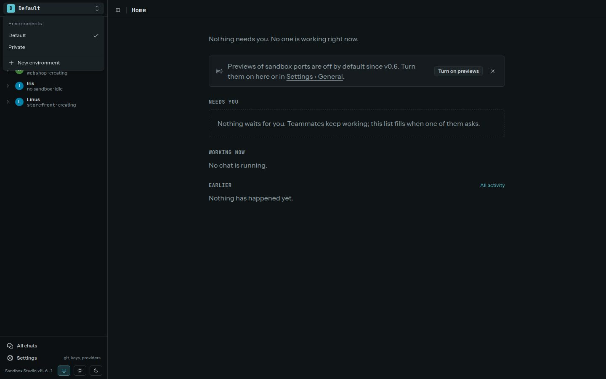

An environment is a separate workspace inside Studio. Use the switcher at the top of the sidebar to move between environments or create another one. To rename one, change its name under **Settings → General**; its sandboxes and links stay as they are.

To delete one, use **Delete…** on the same page and type its name. Studio stops and removes its computers with their disks, and deletes its templates, teammates, chats, memory, providers, secrets and rules. It can't be undone, so export the environment first if you may want its configuration back. While a computer is busy, an import runs or a template builds, Studio refuses and says why. The last environment can't be deleted.

Each environment has its own:

- sandboxes and templates;
- network rules and approval inbox;
- secrets and AI providers;
- teammates, Git forges, and memory.

For example, keep work credentials and network rules in a **Work** environment and personal projects in **Private**. A sandbox belongs to one environment, and an agent can use only that environment's providers, secrets, rules, and memory.

## Scoping a rule

Network rules can apply to every sandbox in an environment, one teammate's sandboxes, or one sandbox. A teammate rule follows the teammate's ownership; it does not grant access to another teammate's sandboxes. An environment-level deny acts as a fence and takes precedence over narrower allows.

See [Network rules](../network/) for rule actions and [Teammates and providers](../teammates-providers/) for sandbox ownership.

## Export and import an environment

To set up the same environment on another Studio, or share it, choose **Export environment** under **Settings → General**. The `.studio-environment` file holds the environment's providers, teammates, environment and teammate rules, secret names with their hosts, and template specs. It leaves out provider keys, secret values, forge tokens, sandboxes, sandbox-scoped rules and secrets, memory, chats, approvals, and built templates. Template setup scripts and souls are in the file as you wrote them, so read it before you share it.

**Import environment** creates a new environment from such a file. Studio checks every value first, and an invalid file creates nothing. Afterwards it lists what the file left out: add each provider's key and each secret's value, and build the templates from their specs.
